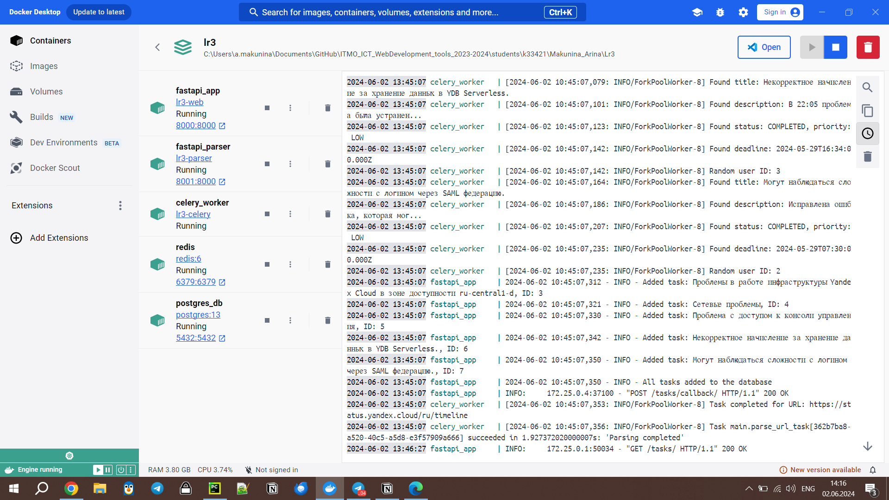

# Лабораторная работа №3: Упаковка FastAPI приложения в Docker, Работа с источниками данных и Очереди

Цель: Научиться упаковывать FastAPI приложение в Docker, интегрировать парсер данных с базой данных и вызывать парсер через API и очередь.

## Структура проекта

```plaintext
application/
├── backend/
│   ├── __init__.py
│   ├── app.py
│   ├── database.py
│   ├── main.py
│   ├── models.py
├── endpoints/
│   ├── __init__.py
│   ├── auth.py
parser/
│   ├── celery_config.py
│   ├── main.py
├── docker-compose.yml
├── main.Dockerfile
├── parser.Dockerfile
├── requirements.txt
├── .env
```

## FastAPI приложение

### app.py

Файл `app.py` содержит инициализацию приложения FastAPI `web`.

```python
from fastapi import FastAPI

app = FastAPI()
```

#### Модель данных

```python
class ParseRequest(BaseModel):
    url: str
    callback_url: str
```

Эта модель описывает структуру запроса на парсинг URL.

#### Маршрут для парсинга

```python
@app.post("/parse/")
async def parse_url(request: ParseRequest):
    task = parse_url_task.delay(request.url, request.callback_url)
    return {"task_id": task.id}
```

Этот маршрут принимает запросы на парсинг URL и передает задачу Celery.

#### Маршрут для получения результата

```python
@app.get("/result/{task_id}")
def get_result(task_id: str):
    result = AsyncResult(task_id, app=celery_app)
    if result.state == "SUCCESS":
        return {"status": result.state, "result": result.result}
    return {"status": result.state}
```

Этот маршрут позволяет получить статус и результат выполнения задачи по ее ID.

#### Функция для парсинга данных

```python
def parse_data(url):
    logging.info(f"Started scraping site {url}")
    options = webdriver.ChromeOptions()
    options.add_argument("--headless")
    options.add_argument("--no-sandbox")
    options.add_argument("--disable-dev-shm-usage")
    service = Service("/usr/bin/chromedriver")
    driver = webdriver.Chrome(service=service, options=options)
    driver.get(url)
    driver.implicitly_wait(20)
    elements = css_elements[url]

    incidents = driver.find_elements(By.CSS_SELECTOR, elements["incident_container"])
    data = []
    successful_additions = 0

    # Парсинг данных
    ...

    return data
```

Эта функция выполняет парсинг данных с указанного URL.

#### Задача Celery

```python
@shared_task
def parse_url_task(url, callback_url):
    logging.info(f"Starting task for URL: {url}")
    data = parse_data(url)
    response = requests.post(callback_url, json=data)
    if response.status_code != 200:
        logging.error(f"Failed to send data to callback URL: {callback_url}")
        return f"Failed to send data to callback URL: {callback_url}"
    logging.info(f"Task completed for URL: {url}")
    return "Parsing completed"
```

Эта задача выполняет парсинг URL и отправляет результат на указанный callback URL.

## Конфигурация Celery

### celery_config.py

Файл `celery_config.py` содержит настройки Celery и Redis.

#### Импортируемые модули

```python
from celery import Celery
import os
```

#### Настройка Celery

```python
REDIS_URL = os.getenv("REDIS_URL")

celery_app = Celery("parser", broker=REDIS_URL, backend=REDIS_URL)

celery_app.conf.update(
    task_serializer="json",
    accept_content=["json"],
    result_serializer="json",
    timezone="UTC",
    enable_utc=True,
)

celery_app.autodiscover_tasks(["main"])
```

Этот файл настраивает Celery для использования Redis в качестве брокера и бэкэнда для хранения результатов задач.

## Сборка и запуск контейнеров

### docker-compose.yml

Файл `docker-compose.yml` описывает все сервисы, необходимые для работы приложения.

```yaml
version: "3.8"

services:
  web:
    build:
      context: ../../../../../Downloads
      dockerfile: main.Dockerfile
    container_name: fastapi_app
    ports:
      - "8000:8000"
    env_file:
      - .env
    depends_on:
      db:
        condition: service_healthy
      redis:
        condition: service_healthy
      celery:
        condition: service_healthy
    volumes:
      - ./application:/app

  parser:
    build:
      context: ../../../../../Downloads
      dockerfile: parser.Dockerfile
    container_name: fastapi_parser
    ports:
      - "8001:8000"
    env_file:
      - .env
    depends_on:
      db:
        condition: service_healthy
      redis:
        condition: service_healthy
    volumes:
      - ./parser:/app

  db:
    image: postgres:13
    container_name: postgres_db
    environment:
      POSTGRES_USER: postgres
      POSTGRES_PASSWORD: 2512
      POSTGRES_DB: web
    ports:
      - "5432:5432"
    volumes:
      - postgres_data:/var/lib/postgresql/data
    healthcheck:
      test: [ "CMD-SHELL", "pg_isready -U postgres" ]
      interval: 10s
      timeout: 5s
      retries: 5

  redis:
    image: redis:6
    container_name: redis
    ports:
      - "6379:6379"
    healthcheck:
      test: [ "CMD", "redis-cli", "ping" ]
      interval: 10s
      timeout: 5s
      retries: 5

  celery:
    build:
      context: ../../../../../Downloads
      dockerfile: parser.Dockerfile
    command: [ "python", "-m", "celery", "-A", "celery_config.celery_app", "worker", "--loglevel=info" ]
    container_name: celery_worker
    env_file:
      - .env
    depends_on:
      db:
        condition: service_healthy
      redis:
        condition: service_healthy
    healthcheck:
      test: [ "CMD-SHELL", "celery -A celery_config.celery_app status" ]
      interval: 30s
      timeout: 10s
      retries: 5
    volumes:
      - ./parser:/app

volumes:
  postgres_data:
```

### main.Dockerfile

Файл `main.Dockerfile` описывает сборку образа для основного приложения.

```dockerfile
FROM python:3.11

WORKDIR /app

COPY requirements.txt /app/requirements.txt

RUN pip install -r /app/requirements.txt

COPY .. /app

COPY .env /app/

EXPOSE 8000

CMD ["uvicorn", "backend.main:app", "--host", "0.0.0.0", "--port", "8000"]
```

### parser.Dockerfile

Файл `parser.Dockerfile` описывает сборку образа для парсера.

```dockerfile
FROM python:3.11

RUN apt-get update && apt-get install -y \
    wget \
    unzip \
    xvfb \
    gnupg \
    libnss3 \
    libgconf-2-4 \
    libxss1 \
    libappindicator3-1 \
    libasound2 \
    fonts-liberation \
    libappindicator3-1 \
    xdg-utils \
    && rm -rf /var/lib/apt/lists/*

# Установка Google Chrome версии 125.0.6422.141
RUN wget https://storage.googleapis.com/chrome-for-testing-public/125.0.6422.141/linux64/chrome-linux64.zip \
    && unzip chrome-linux64.zip -d /opt/ \
    && mv /opt/chrome-linux64 /opt/google-chrome \
    && ln -s /opt/google-chrome/chrome /usr/bin/google-chrome \
    && rm chrome-linux64.zip

# Установка ChromeDriver версии 125.0.6422.141
RUN wget https://storage.googleapis.com/chrome-for-testing-public/125.0.6422.141/linux64/chromedriver-linux64.zip \
    && unzip chromedriver-linux64.zip \
    && mv chromedriver-linux64/chromedriver /usr/bin/chromedriver \
    && chown root:root /usr/bin/chromedriver \
    && chmod +x /usr/bin/chromedriver \
    && rm chromedriver-linux64.zip

RUN ls -l /usr/bin/chromedriver

WORKDIR /app

COPY ./requirements.txt /app/requirements.txt

RUN pip install -r /app/requirements.txt

COPY . /app


COPY .env /app/

EXPOSE 8000

CMD ["uvicorn", "main:app", "--host", "0.0.0.0", "--port", "8000"]
```

## Файл .env

Файл `.env` содержит конфигурационные параметры для подключения к базе данных и Redis.

## Собранные контейнеры:

